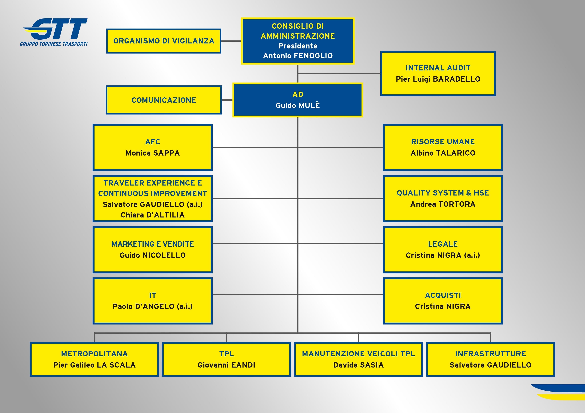
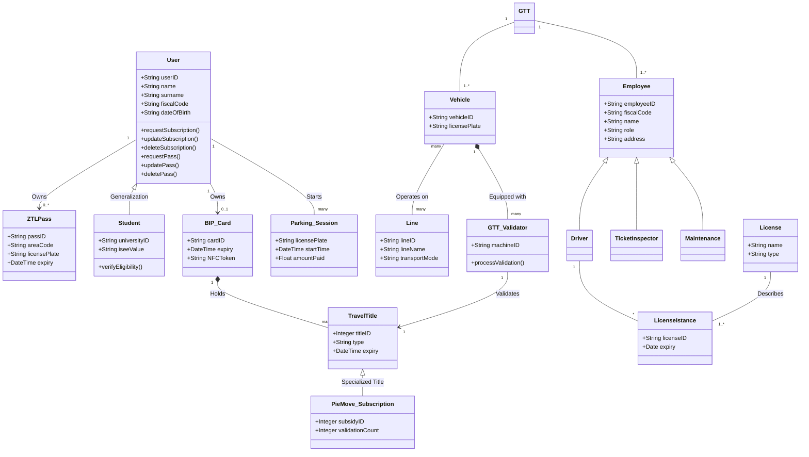
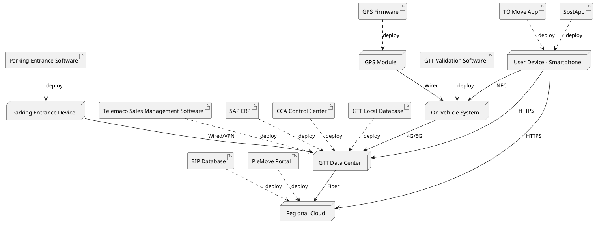

# Model of Organization – As Is

## Contents

- [Model of Organization – As Is](#model-of-organization--as-is)
  - [Contents](#contents)
  - [Identification](#identification)
  - [Financial and legal information](#financial-and-legal-information)
  - [Organizational variables](#organizational-variables)
    - [Size](#size)
    - [Services](#services)
    - [Goal, goal type, mission, vision, strategy](#goal-goal-type-mission-vision-strategy)
    - [Culture](#culture)
    - [Structure](#structure)
    - [IT group](#it-group)
    - [Structural Dimensions](#structural-dimensions)
    - [Organizational type](#organizational-type)
  - [Business Model Canvas](#business-model-canvas)
  - [IS Dimensions](#is-dimensions)
    - [Process dimension](#process-dimension)
      - [Conceptual data model](#conceptual-data-model)
      - [Processes](#processes)
  - [BPMN diagrams](#bpmn-diagrams)
    - [ZTL - limited traffic zone - permit acquisition](#ztl---limited-traffic-zone---permit-acquisition)
    - [BIP Card Acquisition](#bip-card-acquisition)
    - [Technology dimension](#technology-dimension)
      - [Application portfolio](#application-portfolio)
      - [Hardware software architecture](#hardware-software-architecture)
      - [Outsourcing](#outsourcing)
  - [IT strategy](#it-strategy)
  - [Indicators](#indicators)
    - [CSF](#csf)
    - [KPI](#kpi)
      - [**KPI Tables for ZTL Permit Acquisition**](#kpi-tables-for-ztl-permit-acquisition)
        - [**General KPIs**](#general-kpis)
        - [**Efficiency KPIs**](#efficiency-kpis)
        - [**Quality KPIs**](#quality-kpis)
        - [**Services KPIs**](#services-kpis)
    - [BIP Card Acquisition](#bip-card-acquisition-1)
      - [**KPI Tables for BIP Card Acquisition**](#kpi-tables-for-bip-card-acquisition)
        - [**General KPIs**](#general-kpis-1)
        - [**Efficiency KPIs**](#efficiency-kpis-1)
        - [**Quality KPIs**](#quality-kpis-1)
        - [**Services KPIs**](#services-kpis-1)
  - [Summary analysis](#summary-analysis)
    - [Critical Points in the Organization and Their Possible Relation with IS](#critical-points-in-the-organization-and-their-possible-relation-with-is)
    - [IT Alignment Problems](#it-alignment-problems)

---

## Identification

- **Name**: Gruppo Torinese Trasporti S.p.A. (GTT), Corso Filippo Turati 19/6, 10128 Torino (TO), Italy
- **Fiscal ID**: 08555280018
- **Ateco code**: 49.31 (Passenger land transport in urban and suburban areas)

## Financial and legal information

- **Legal form**: S.p.A. (Società per Azioni) – Public Limited Company, entirely owned by the Municipality of Turin through the holding FCT Holding S.r.l.
- **Turn over year 2024**
  - Total turn over (Value of Production): €424.87M.
    - This represents an increase of approximately €10.45M compared to 2023 (when production value was €414.43M).
  - Revenue from Sales: €167.14M.
    - This includes €109.50M from TPL tickets and passes and €44.64 million from parking services.
  - Economic Compensation: €170.54M.
  - Net Result: The company closed the year 2024 with a profit of €12.85M, significantly improving from the €6.15M profit in 2023.

## Organizational variables

### Size

**Number of FTEs, year 2024**: The average annual economic forecast for 2024 was 3,700 FTEs.

- Total headcount (31/12/2024): 3,733 employees (a decrease of 178 units from 2023).
- 1,947 line drivers, 65 metro-rail workers, 223 parking/TPL control staff, 488 laborers, and 977 administrative/managerial staff.

### Services

GTT manages local public transport (TPL) and related mobility services in the Piedmont Region:

- **Urban and Suburban Transport**: Management of the automatica Metro Line 1, 8 tram lines (~200 km of tracks), and 88 urban/suburban bus lines.
- **Extra-urban Transport**: Approximately 70 bus lines serving 264 municipalities in the provinces of Turin, Cuneo, Asti, and Alessandria.
- **Parking Services**: Management of ~50,000 street parking spaces (strisce blu) and 30 parking structures (~6,000 spaces) in Turin.
- **Tourist and Special Services**: Sassi-Superga rack railway, Mole Antonelliana panoramic lift, historical trams, "Venaria Express" bus, and the "Ristocolor/Gustotram" restaurant trams.

### Goal, goal type, mission, vision, strategy

The Board of Directors approved a revision of these pillars on November 8, 2023, aligned with th 2023-2027 Industrial Plan.

- **Mission**: To offer competitive mobility services in terms of quality and cost-effectiveness using sustainable technologies and energy sources, contributing to the environmental and social improvement of the local community.
- **Vision**: To design a sustainable transport service focused on client needs, pursuing intermodal integration and leveraging technological innovation.
- **Strategy**: Focused on fleet renewal (electric and natural gas vehicles), digital transformation (MaaS - Mobility as a Service), and financial recovery (achieving positive results to recover previous losses by 2027).

### Culture

- **Values**: Centrality of the person, economic efficiency, environmental and social responsibility, transparent communication, and corporate identity.
- **Governance Standards**: Strong emphasis on compliance, including ISO 37001 (anti-corruption), ISO 27001 (information security), ans UNI PDR 152:2022 (gender equality).

### Structure

GTT is headed by a Board of Directors with a President and CEO.

<figure>

<figcaption>Organizational chart January, 2026</figcaption>
</figure>

The structure is functional, recently undesgoing a transition to centralize production processes into a single "Area unica dedicata all'esercizio del trasporto e alle infrastrutture" (Single Area for Transport Operations and Infrastructure) to improve qualitative standards. This was a shift from a purely functional structure towards a more process-oriented one, aimed at integrating transport and infrastructure maintenance.

### IT group

- **Description**: A dedicated Information Technology (IT) sector provides infrastructure mainteance, technical assistance, and software develompement for all business processes (operations, maintenance, sales, admin, HR).
- **Management**: Manages the Corporate Control Center (Centro di Controllo Aziendale - CCA), the electronic ticketiking system (BIP - Biglieto Integrato Piemonte), e-commerce platforms, and the "TO Move" and "SostApp" mobile applications.
- **Expense**: GTT's IT budget is heavily weighted toward digital transformation and "dematerialization". IT projects are capitalized under "Intangible Assets". In 2024, computer projects and BIP system costs were significant components of the 2.5M intangible amortization.
- **Ratio IT Expense / Turnover Ratio in year 2024**
  - Turnover (Value of Production): €424,874,769.
  - Identified IT Expenses: Approximately €5,317,000 (Total of operational and capitalized identified IT costs).
  - Amortization of Intangible Assets (Patents & Software, including BIP project): €2,537,540.
  - IT-specific project capitalizations (Software projects like Telemaco, SL, Major): Estimated at €2,779,460 (Derived from a portion of the €5,863,560 total internal capitalizations specifically allocated to "IT and other software projects" in asset notes).
  - Calculated Ratio: ~1.25%

### Structural Dimensions

- **Formalization (High)**: GTT operates in a highly regulated environment. Operations are governed by strict Service Contracts with the Agenzia della Mobilità Piemontese and the City of Turin. Internal processes are standardized through ISO certifications and specific safety protocols for rail and metro operations.
- **Specialization (High)**: The organization is diveded into highly specific technical roles. Personnel are categorized into distincr professional families (e.g., specialized technicians for the automatic metro, railway traffic regulators, and parking management officers). This ensures that complex technical infrastructures are managed by experts in that specific domain.
- **Centralization (High)**: Decision-making power is concentrated at the top management level (Board of Directors and CEO). Following the recent 2024 organizational restructuring, there is an even stronger push towards centralization by merging all production and infrastructure management into a single "Area Unica" to ensure uniform qualitative standards across the city.

### Organizational type

- **Mechanical vs. Learning**: GTT is a Mechanical organization. Its core business (transport) requires high predictability, standardization of "time-tables", and strict adherence to safety soutines. While it is experimenti with "Learning" through the _Living Lab_ for autonomous shuttles, the vast majority of the 3,700 employees work within a rigid, rule-based framework.
- **Classification**: It is a Divisionalized Bureaucrary. While it has a central "Technostructure" that sets the rules, it operates through distinct business units (Surface Transport, Metro, Parking) that act as divisions serving diffeent customer needs under the same corporate brand. The divisions (Surface, Metro, Parking) are unified by the Technostructure which standardizes the outputs.

---

## Business Model Canvas

1. Key Partners
   - Public Authorities: City of Turin, Piedmont Region.
   - Regulators: Agenzia della Mobilità Piemontese (AMP).
   - Infrastructure: InfraTo (for Metro infrastructures), RFI (for rail connections).
   - Technology/Data: 5T S.r.l. (traffic & real-time info), BIP (Electronic Ticketing Consortium).
   - Suppliers: Energy providers (IREN), vehicle manufacturers (Iveco, Alstom).

2. Key Activities (Key Processes)
   - Transport Operations: Managing the flow of buses, trams, and Metro Line 1.
   - Fleet & Infrastructure Maintenance: Technical upkeep of vehicles and tracks.
   - Sales & Revenue Management: Management of the BIP system, ticketing apps, and control against evasion.
   - Parking Management: Managing blue zones and automated parking structures.
   - Mobility as a Service (MaaS): Integrating digital transport data for users.

3. Value Propositions
   - Integrated Mobility: One system for bus, tram, metro, and parking.
   - Sustainability: Reducing the city's carbon footprint via electric and methane fleets.
   - Urban Accessibility: Providing affordable, capillary transport to all citizens.
   - Innovation: Real-time arrival info and seamless mobile payments (TO Move application).

4. Customer Relationships
   - Self-Service: Digital ticketing via apps and vending machines.
   - Automated Services: Real-time SMS/Web updates on line status.
   - Personal Assistance: GTT customer centers and physical help desks.
   - Institutional: Relationship with the Municipality as the primary client.

5. Customer Segments
   - Daily Commuters: Workers and residents in the Turin metropolitan area.
   - Students: High volume of seasonal pass holders.
   - Tourists: Users of special lines (Superga, Mole Antonelliana).
   - Drivers: Users of the urban parking system.
   - Public Administration: The City of Turin as a "B2G" customer.

6. Key Resources
   - Physical: A fleet of ~1,000 buses, 200 trams, and metro trains; depots and rails.
   - Human: 3,700 employees (drivers, technicians, IT specialists).
   - Technological: The BIP System, Corporate Control Center (CCA), and MaaS platforms.
   - Financial: Regional subsidies and municipal capital.

7. Channels
   - Physical: Transit stops, metro stations, and GTT Point offices.
   - Digital: GTT Website, TO Move App, SostApp (for parking).
   - Retail: Authorized tobacco shops.

8. Cost Structure
   - Personnel: ~€180M (the largest operating cost).
   - Energy & Fuel: Electricity for trams/metro and fuel for buses.
   - Maintenance: Spare parts and technical labor for the fleet.
   - IT Amortization: Investments in software and digital ticketing.

9. Revenue Streams
   - Traffic Revenue: Ticket sales and subscriptions (~€109M).
   - Parking Fees: Revenue from "strisce blu" and parking garages (~€44M).
   - Subsidies: Economic compensation from public contracts (~€170M).
   - Advertisement: Advertising on vehicles and tourist services.

---

## IS Dimensions

### Process dimension

#### Conceptual data model

#### Processes

| Process name                                        | Description                                                                                                                                                       | Input                                                                                   | Output                                                                       | Organizational units involved                                                   |
| :-------------------------------------------------- | :---------------------------------------------------------------------------------------------------------------------------------------------------------------- | :-------------------------------------------------------------------------------------- | :--------------------------------------------------------------------------- | :------------------------------------------------------------------------------ |
| **Real-time Bus Line Monitoring**                   | The customer accesses the GTT website to visualize the full route map, track vehicle GPS positions, and check live arrival times by selecting specific stops.     | Line number/name, Stop selection, Web request.                                          | Visual map of vehicle locations, Dynamic list of expected arrival times.     | Control Center (CCA), IT Sector, 5T S.r.l. (GPS Data).                          |
| **Travel Title Acquisition**                        | The customer purchases a single ticket or a regular subscription through digital channels (TO Move app, e-commerce) or physical retailers.                        | Payment method (Credit Card/Cash), Selection of ticket type (Urban/Suburban).           | Validated travel title (Digital QR code, Chip-on-paper, or Smart card load). | Sales Dept (Area Commerciale), IT Sector (Telemaco system), External Retailers. |
| **Ticket Validation**                               | The physical act of boarding a vehicle and "tapping" the BIP card/credit card/smartphone/physical ticket.                                                         | BIP Card/Credit card/Smartphone/Physical ticket, presence on vehicle.                   | Successful validation (green light), legal travel status.                    | Operations (Area Esercizio), Maintenance (Validators).                          |
| **On-Street Parking (Physical Ticket)**             | The customer parks in "strisce blu," enters the license plate into a physical meter, and pays (cash/card) to obtain a paper receipt to display.                   | License plate number, Payment (Cash/Card).                                              | Printed physical ticket for dashboard display.                               | Parking Dept, Maintenance (Parking Meters).                                     |
| **On-Street Parking (Digital Ticket)**              | The customer manages their stay via the SostApp app by entering the plate number and paying digitally, without needing a paper receipt.                           | License plate number, SostApp profile, Digital payment.                                 | Virtual authorization linked to license plate in GTT database.               | Parking Dept, IT Sector (SostApp).                                              |
| **Parking in a Covered Parking Lot**                | The customer takes a physical ticket at the barrier and enters, paying at an internal station before exiting.                                                     | Entry ticket, Payment at station.                                                       | Automatic barrier opening and exit authorization.                            | Parking Dept, IT Sector.                                                        |
| **Customer Support & Feedback**                     | The customer seeks assistance or reports service issues via digital or physical touchpoints.                                                                      | Inquiry/Complaint, Ticket ID, Customer data.                                            | Resolution, information, or refund.                                          | Customer Care, Quality & Compliance Unit.                                       |
| **Ticket Inspection**                               | GTT inspectors perform random or systematic checks on vehicles to verify the possession and correct validation of travel titles.                                  | Travel document (BIP card, paper ticket, digital QR code), Inspector's handheld device. | Ticket validity                                                              | Customer Assistance & Inspection Unit, Administration Dept, IT Sector.          |
| **Parking Ticket Inspection**                       | GTT inspectors perform random or systematic checks on parked vehicles to verify the possession and correct validation of parking tickets.                         | Parking ticket.                                                                         | Ticket validity                                                              | Customer Assistance & Inspection Unit, Administration Dept, IT Sector.          |
| **ZTL - limited traffic zone - permit acquisition** | The first issue requires an in-person appointment at a GTT center for document verification; renewals are managed via the online portal.                          | License plate, ID, Residency/Work proof, Payment.                                       | Valid ZTL permit                                                             | Customer Service Centers, IT Sector.                                            |
| **BIP Card Acquisition**                            | The customer requests a new physical smart card either online (during subscription purchase) or at a physical desk (for new titles or lost/stolen card recovery). | Personal ID, Digital/Physical photo, Payment, Replacement request (if lost).            | Physical BIP Card delivered via mail or collected at GTT centers.            | Commercial Front-Office, BIP Consortium (Card production & logistics).          |

## BPMN diagrams

### ZTL - limited traffic zone - permit acquisition

This analysis focuses exclusively on the first issue of ZTL permits.

### BIP Card Acquisition

This analysis focuses exclusively on the internal GTT operational workflows following the customer's request, bypassing the initial external purchase phase performed by the user.

### Technology dimension

#### Application portfolio

Based on the 2024 Financial Statements, GTT relies on a mix of legacy systems and modern clous integrations.

| Application name                | Vendor (or internal if made internally) | Main functions                                                                          |
| :------------------------------ | :-------------------------------------- | :-------------------------------------------------------------------------------------- |
| BIP System                      | BIP Consortium                          | Centralized regional electronic ticketing, smart card management, and clearing.         |
| Telemaco                        | Internal                                | Revenue management, accounting of sales from 1,200+ retailers, and financial reporting. |
| To Move                         | Internal and 5T S.r.l.                  | Customer App for ticket purchase (NFC/QR) and real-time transit information.            |
| SostApp                         | Internal                                | Digital payment for on-street parking ("strisce blu").                                  |
| CCA (Central Control)           | Leonardo and Thales                     | Real-time fleet tracking (AVM - Automatic Vehicle Monitoring) and radio communication.  |
| SIS (Sistema Informativo Sosta) | Internal                                | Management of automated barriers and payment terminals in covered parking structures.   |
| SAP                             | SAP                                     | Administrative functions: accounting, human resources, and procurement.                 |

#### Hardware software architecture

#### Outsourcing

In GTT there are a few outsourced services:

- **BIP Infrastructure**: Management of the smart card registry and clearing is outsourced to the BIP Consortium.

- **Cloud Hosting**: The PieMove portal and regional databases are hosted by CSI Piemonte.

- **Data Services**: Real-time traffic data and GPS integration are provided by 5T S.r.l. (as part of the MaaS strategy).

- **Hardware Maintenance**: On-board validators and physical parking meters are maintained through service contracts with external technical suppliers (e.g., Leonardo, Thales).

---

## IT strategy

The current IT strategy is focused on Digital Transformation and Dematerialization (Account-Based Ticketing).

- **Consistency**: This is highly consistent with the company’s Industrial Plan 2023-2027. By moving sales to digital channels (TO Move, SostApp) and integrating with MaaS, GTT reduces the cost of maintaining physical vending machines and retailers.

- **Focus**: The shift toward "Tap & Go" (using bank cards directly on validators) aligns with the goal of reducing friction for non-regular users and tourists, directly increasing revenue from sales.

---

## Indicators

### CSF

| CSF ID | Type               | Textual description, link to strategy                                                                                                                                                | Related Metric(s)                                                       | Current value (2024)                                                           |
| :----- | :----------------- | :----------------------------------------------------------------------------------------------------------------------------------------------------------------------------------- | :---------------------------------------------------------------------- | :----------------------------------------------------------------------------- |
| CSF1   | **Distinguishing** | Digital Self-Service adoption: Minimizing physical desk interaction for subscriptions.                                                                                               | % of online renewals.                                                   | €65.1M total digital rev. (+28.6%); TO Move app sales +101.7%                  |
| CSF2   | **Environment**    | System Interoperability: Integration with regional (BIP) and city (ZTL) databases.                                                                                                   | API Uptime / Sync Latency.                                              | 99.63% Metro regularity; 98% Escalator uptime (Dec 2024)                       |
| CSF3   | **Domain**         | Revenue Protection: Minimizing evasion through efficient validation and inspection.                                                                                                  | Evasion rate.                                                           | 2.92M passengers controlled; Evasion on Line 4 dropped to 5.8%                 |
| CSF4   | **Contingency**    | Crisis Resilience & Recovery: The ability of the IS to maintain core operations (safety, communication, and emergency ticketing) during strikes, extreme weather, or system outages. | Recovery Time Objective (RTO) for mission-critical systems (e.g., CCA). | 83 new low-emission vehicles entered service; Successful Cyber-attack defense. |

### KPI

#### **KPI Tables for ZTL Permit Acquisition**

##### **General KPIs**

| KPI name                | KPI type | Description                                 | Unit of measure | CSF covered | Current value (As-Is)        |
| :---------------------- | :------- | :------------------------------------------ | :-------------- | :---------- | :--------------------------- |
| **Input volumes**       | General  | Total ZTL permit requests processed         | Count           | CSF2        | **~5,000** (Annual requests) |
| **Output volumes**      | General  | Successfully issued or renewed permits      | Count           | CSF2        | **~5,000**                   |
| **Human resources**     | General  | Staff dedicated to ZTL front-office         | FTE             | -           | **~15 FTE**                  |
| **Non human resources** | General  | Physical service centers (GTT Points)       | Count           | CSF1        | **3 Centers**                |
| **Inventory**           | General  | Physical forms                              | Count           | -           | **Minimal**                  |
| **Other resources**     | General  | Database server capacity for license plates | GB              | CSF2        | **Active/Scalable**          |

##### **Efficiency KPIs**

| KPI name          | KPI type   | Description                           | Unit of measure | CSF covered | Current value (As-Is)  |
| :---------------- | :--------- | :------------------------------------ | :-------------- | :---------- | :--------------------- |
| **Cost per unit** | Efficiency | Administrative cost per issued permit | € / Permit      | CSF3        | **~€12.00**            |
| **Total cost**    | Efficiency | Total ZTL office operating costs      | Euro (€)        | CSF3        | **~€0.9 Million**      |
| **Productivity**  | Efficiency | Permits processed per employee        | Count / FTE     | CSF1        | **~5,000 Permits/FTE** |
| **Utilization**   | Efficiency | Front-office desk occupancy rate      | %               | -           | **85%**                |

##### **Quality KPIs**

| KPI name         | KPI type | Description                                       | Unit of measure | CSF covered | Current value (As-Is) |
| :--------------- | :------- | :------------------------------------------------ | :-------------- | :---------- | :-------------------- |
| **Conformity**   | Quality  | Permits issued according to municipal regulations | %               | CSF2        | **100%**              |
| **Reliability**  | Quality  | System uptime (Portal/Database)                   | %               | CSF2        | **98.5%**             |
| **Satisfaction** | Quality  | User experience rating (Customer Sat)             | 1-5 Scale       | CSF1        | **3.2 / 5**           |

##### **Services KPIs**

| KPI name           | KPI type | Description                               | Unit of measure | CSF covered | Current value (As-Is) |
| :----------------- | :------- | :---------------------------------------- | :-------------- | :---------- | :-------------------- |
| **Lead time**      | Services | Time from request to permit activation    | Days            | CSF2        | **~1 Day**            |
| **Cycle time**     | Services | Average physical appointment duration     | Minutes         | CSF2        | **15-20 Minutes**     |
| **Response**       | Services | Response time to email/info requests      | Hours           | CSF1        | **48 - 72 Hours**     |
| **Punctuality**    | Services | Appointments started on schedule          | %               | CSF2        | **60%**               |
| **Flexibility**    | Services | Capacity to handle seasonal demand spikes | %               | CSF4        | **Low**               |
| **Perfect orders** | Services | Permits issued without data errors        | %               | CSF2        | **99.2%**             |

### BIP Card Acquisition

#### **KPI Tables for BIP Card Acquisition**

##### **General KPIs**

| KPI name                | KPI type | Description                                      | Unit of measure | CSF covered | Current value (As-Is)       |
| :---------------------- | :------- | :----------------------------------------------- | :-------------- | :---------- | :-------------------------- |
| **Input volumes**       | General  | Total requests for new or replacement BIP cards  | Count           | CSF1        | **~115,000** (Annual est.)  |
| **Output volumes**      | General  | Physical smart cards successfully issued/shipped | Count           | CSF1        | **~112,000**                |
| **Human resources**     | General  | GTT staff managing card requests/desk support    | FTE             | -           | **~15 FTE**                 |
| **Non human resources** | General  | Digital portals and physical collection points   | Count           | CSF1        | **1 Portal / 3 GTT Points** |
| **Inventory**           | General  | Stock of blank smart cards                       | Count           | CSF4        | **~25,000 units**           |
| **Other resources**     | General  | Secure shipping and logistics services           | -               | -           | **External (Post/Courier)** |

> Note: The 15 FTEs dedicated to the front office are shared among ZTL and BIP tasks.

##### **Efficiency KPIs**

| KPI name          | KPI type   | Description                                     | Unit of measure | CSF covered | Current value (As-Is)    |
| :---------------- | :--------- | :---------------------------------------------- | :-------------- | :---------- | :----------------------- |
| **Cost per unit** | Efficiency | Cost of production and shipping per card        | € / Card        | CSF3        | **€3.00**                |
| **Total cost**    | Efficiency | Total annual expenditure for card logistics     | Euro (€)        | CSF3        | **~€0.35 Million**       |
| **Productivity**  | Efficiency | Applications processed per administrative staff | Count / FTE     | CSF1        | **~14,000 Cards/FTE**    |
| **Utilization**   | Efficiency | Utilization of the online card ordering system  | %               | CSF1        | **65% (Online vs Desk)** |

##### **Quality KPIs**

| KPI name         | KPI type | Description                                  | Unit of measure | CSF covered | Current value (As-Is) |
| :--------------- | :------- | :------------------------------------------- | :-------------- | :---------- | :-------------------- |
| **Conformity**   | Quality  | Cards compliant with regional BIP standards  | %               | CSF2        | **100%**              |
| **Reliability**  | Quality  | NFC/Chip success rate upon first use         | %               | CSF2        | **99.5%**             |
| **Satisfaction** | Quality  | Customer rating of the card delivery process | 1-5 Scale       | CSF1        | **3.5 / 5**           |

##### **Services KPIs**

| KPI name           | KPI type | Description                                          | Unit of measure | CSF covered | Current value (As-Is) |
| :----------------- | :------- | :--------------------------------------------------- | :-------------- | :---------- | :-------------------- |
| **Lead time**      | Services | Time from request to card receipt (home delivery)    | Days            | CSF2        | **7 - 10 Days**       |
| **Cycle time**     | Services | Average time to process a request at the desk        | Minutes         | CSF2        | **10 - 15 Minutes**   |
| **Response**       | Services | Time to address issues with faulty/lost cards        | Hours           | CSF1        | **24 - 48 Hours**     |
| **Punctuality**    | Services | Cards delivered within the promised timeframe        | %               | CSF2        | **88%**               |
| **Flexibility**    | Services | Ability to expedite cards during student peak (Sept) | %               | CSF4        | **Medium**            |
| **Perfect orders** | Services | Cards delivered with correct data and active titles  | %               | CSF2        | **98.8%**             |

---

## Summary analysis

### Critical Points in the Organization and Their Possible Relation with IS

- **ZTL – Hybrid Workflow Inefficiency**: The mandatory physical appointment for the initial ZTL permit issuance remains a significant bottleneck. This requirement reveals a lack of integration between the GTT Information System and national digital identity platforms (e.g., SPID/CIE). The current "As-Is" Lead Time of ~1 day and the reliance on manual document verification by staff results in lower administrative productivity and customer friction.

- **Physical Logistics and Lead Times (BIP Card)**: The issuance of physical smart cards relies on an external supply chain (BIP Consortium and postal services), leading to a Lead Time of 7-10 days. This physical dependency prevents an instantaneous service delivery and incurs significant logistical costs (~€0.35M annually) that could be mitigated through further virtualization of travel titles.

- **Service Fragmentation (Silos)**: Despite the success of apps like TO Move and SostApp, the digital ecosystem still operates in functional silos. Users must manage different accounts and platforms for transit versus parking, indicating that the IS has not yet achieved a unified MaaS (Mobility as a Service) architecture.

### IT Alignment Problems

- **Legacy vs. Digital Strategy**: There is a visible gap between GTT’s strategic goal of full digitalization and the "As-Is" reality where several high-volume processes (ZTL, physical BIP cards) still require physical presence or physical media. The IT infrastructure is currently aligned but reactive, rather than being a driver of full process automation.

- **Data Integration & Interoperability**: The Information System struggles to provide a "Single Source of Truth" across all divisions. The latency in synchronization between the central BIP Registry (Regional Cloud) and local GTT databases can occasionally cause delays in ticket activation, affecting the Perfect Order Rate (98.8%).

- **Underutilization of Big Data**: Although the IS collects vast amounts of GPS and validation data (via the CCA and BIP systems), it is primarily used for monitoring rather than optimization. There is a lack of alignment in using this data for Predictive Maintenance or dynamic fleet reallocation, which remains a "To-Be" objective.
