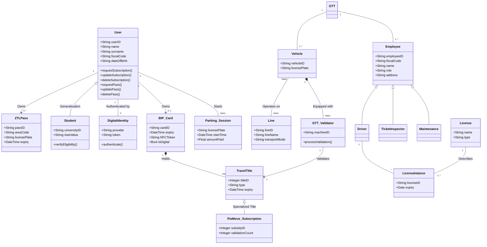
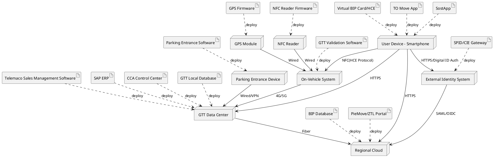

# Model of Organization – To Be

## Contents

- [Model of Organization – To Be](#model-of-organization--to-be)
  - [Contents](#contents)
  - [Summary of changes](#summary-of-changes)
    - [Pick Chart](#pick-chart)
  - [Organizational variables](#organizational-variables)
    - [Size](#size)
    - [Products, services](#products-services)
    - [Goal, goal type, mission, vision, strategy](#goal-goal-type-mission-vision-strategy)
    - [Culture](#culture)
    - [Structure](#structure)
    - [IT group](#it-group)
    - [Structural dimensions](#structural-dimensions)
    - [Organizational type](#organizational-type)
  - [Business Model Canvas](#business-model-canvas)
  - [IS Dimensions](#is-dimensions)
    - [Process dimension](#process-dimension)
      - [Conceptual data model](#conceptual-data-model)
        - [Key changes to the model](#key-changes-to-the-model)
      - [Processes](#processes)
    - [ZTL - limited traffic zone - permit acquisition](#ztl---limited-traffic-zone---permit-acquisition)
    - [BIP Card Acquisition](#bip-card-acquisition)
    - [Technology dimension](#technology-dimension)
  - [IT strategy](#it-strategy)
  - [Effect of changes](#effect-of-changes)
    - [Effect on KPIs and CSFs](#effect-on-kpis-and-csfs)
      - [Impact on CFSs](#impact-on-cfss)
      - [Effect on ZTL Permit Acquisition KPIs](#effect-on-ztl-permit-acquisition-kpis)
      - [Effect on BIP Card Acquisition KPIs](#effect-on-bip-card-acquisition-kpis)
  - [TCO, ROI and Break even](#tco-roi-and-break-even)
    - [TCO](#tco)
    - [ROI](#roi)
  - [Change management plan](#change-management-plan)
    - [Risk Factors](#risk-factors)
    - [Change Plan](#change-plan)
  - [Conclusion](#conclusion)

---

## Summary of changes

- **Description**: The primary changes involve the full digitalization of the ZTL (Limited Traffic Zone) permit acquisition and the introduction of a Virtual BIP Card via the TO Move app. The ZTL process moves from a hybrid model (mandatory in-person first issue) to a 100% online workflow using digital identity (SPID/CIE) for automated verification. For the BIP card, while physical cards remain, a new "Instant Virtual Card" mode is added, allowing users to bypass shipping times and validate via smartphone NFC. These changes aim to eliminate physical bottlenecks, reduce administrative costs, and improve user satisfaction by providing instantaneous service.
- **Order of Change**: These are Second Order Changes. They don't just "speed up" the old process (first order) but fundamentally change the way the service is delivered and consumed (re-engineering the relationship between the citizen and the organization through new technology). Risks include digital exclusion for non-tech-savvy users and potential technical failures of the NFC validation system on older buses.

### Pick Chart

|      | Low Payoff | High Payoff                                                                              |
| ---- | ---------- | ---------------------------------------------------------------------------------------- |
| Easy |            | **Implement**: Adding a digital card option while maintaining the physical card as well. |
| Hard |            | **Challenge**: Transitioning first-time ZTL issue to 100% online.                        |

---

## Organizational variables

### Size

- **Number of FTEs**: Limited change in total headcount, but a shift in roles. Approximately 10 FTEs previously dedicated to front-office tasks can be redeployed to higher-value customer support or inspection roles as the manual verification workload decreases.

### Products, services

- **New Service**: "Instant Virtual BIP Card" (Digital-first travel title).
- **Enhanced Service**: "Remote ZTL Permitting" (Fully digital certification).

### Goal, goal type, mission, vision, strategy

- **Strategy**: Acceleration of the "Dematerialization" pillar of the 2023-2027 Industrial Plan. The goal is to reach 90% digital interactions for administrative permits by 2027.

### Culture

- **No changes**: Remains a performance-oriented, compliance-heavy culture, though with an increasing push toward "Digital First" values.

### Structure

- **Organizational chart**: No change in the hierarchy, but the Customer Service Centers will see a reduction in physical foot traffic, leading to a potential downsizing of physical "GTT Points" in favor of digital help-desks.

### IT group

- **Expansion**: Increased responsibility for the IT sector to manage the TO Move app integration with NFC protocols and the secure API bridge for ZTL document verification.

### Structural dimensions

- **Centralization**: Increased. By moving processes online, the control over data verification is centralized into the automated Information System rather than being distributed among various front-office clerks.
- **Formalization**: No changes.
- **Specification**: No changes.

### Organizational type

- **No changes**: Remains a Divisionalized Bureaucracy, but moving closer to a "Professional Bureaucracy" as routine manual tasks are automated, leaving staff to handle complex exceptions.

---

## Business Model Canvas

1. **Key Partners**
   Added "SPID/CIE Identity Providers" and "CSI Piemonte"
2. **Key Activities**
   Added "Digital Identity Management" and "NFC Validation Maintenance."
3. **Value Propositions**
   Instantaneous service delivery; No more waiting for physical mail/appointments.
4. **Customer Relationships**
   No changes
5. **Customer Segments**
   No changes
6. **Key Resources**
   No changes
7. **Channels**
   Focus shifts heavily toward the TO Move App and Online Portal.
8. **Cost Structure**
   Reduction in physical mailing costs for BIP cards and lower overhead for physical office maintenance.
9. **Revenue Stream**
   No changes

---

## IS Dimensions

### Process dimension

#### Conceptual data model

##### Key changes to the model

- **Introduction of DigitalIdentity**: A new class has been added to represent authentication via national platforms like SPID or CIE. This allows the User to be uniquely and securely authenticated online, enabling the organization to move processes like the ZTL Pass acquisition from in-person verification to a fully digital workflow.
- **Virtualization of the BIP_Card**: The BIP_Card class now includes a Bool isDigital attribute. This supports the new "To-Be" strategy of offering a Virtual BIP Card on the TOMove app, which can be issued instantly without the logistical delay or cost of shipping a physical card.

These changes were made to shift GTT from a hybrid/mechanical workflow toward a digital-first strategy. By integrating digital identity, the organization reduces the burden on physical "GTT Points" and eliminates the need for manual document verification. Similarly, the digital version of the BIP card addresses previous "As-Is" bottlenecks related to postal lead times and logistics costs, aligning the Information System with the company’s 2023–2027 Industrial Plan for dematerialization and improved customer satisfaction.

#### Processes

### ZTL - limited traffic zone - permit acquisition

In the TOBE scenario, the first-time issue of ZTL permits is now fully automated and digital. Authentication via SPID/CIE eliminates the need for an in-person visit that was previously mandatory in the ASIS process, making the entire workflow available online end-to-end.

### BIP Card Acquisition

In the TOBE scenario, users can now request a fully digital BIP card.
Unlike the ASIS process — where physical card printing and delivery
required up to 10 working days — the digital option allows immediate card
activation and use, eliminating waiting times entirely.

### Technology dimension

- **Application portfolio:**
  - TO Move (Updated): Enhanced with NFC HCE (Host Card Emulation) capabilities.
  - ZTL Portal (Updated): Integrated with SPID/CIE and municipal registry APIs.
- **Application selection, make vs. buy decision:** Make. GTT already owns the TO Move codebase and the ZTL portal; upgrading them is more cost-effective and ensures better integration with the legacy Telemaco system than buying a third-party solution.
- **Coverage:**

  | Software function needed (from process view) | Software function provided by application selected | Gap analysis                            |
  | :------------------------------------------- | :------------------------------------------------- | :-------------------------------------- |
  | Identity Verification                        | SPID/CIE Integration                               | Fully covered via national gateways.    |
  | Contactless Validation                       | NFC HCE Protocol in App                            | Requires mobile hardware compatibility. |

- **Hardware software architecture:**

The updated hardware architecture focuses on three specific technological shifts:

- **Smartphone Evolution**: The user's device is transformed into a secure terminal that handles Digital Identity (SPID/CIE) for ZTL verification and uses NFC Host Card Emulation (HCE) to function as a virtual smart card.
- **Edge Validation**: On-board validators are upgraded with specialized NFC reader modules to process virtual tokens instantly, removing the reliance on physical chip-on-paper or plastic media.
- **External Integration**: The architecture adds a dedicated bridge to External Identity Gateways, allowing the GTT Data Center to authorize permits in real-time without manual intervention from physical office staff.

* **Integration:**
  - **Data Exchange**: The TO Move app now exchanges encrypted NFC tokens with the on-board validators.

  - **Control Mechanism**: Real-time REST API calls for ZTL permit status checks.

* **Outsourcing**:
  With the new changes, there are no entirely new outsourced organizations, but there is a significant expansion of dependencies on existing third-party digital infrastructures:
  - **Digital Identity Providers (SPID/CIE)**: While not a traditional service contract, GTT now relies on national identity providers to perform the document verification previously handled in-person by staff.
  - **Mobile Software Services**: The reliance on 5T S.r.l. and internal developers increases to maintain the NFC Host Card Emulation (HCE) protocols within the TO Move app.

---

## IT strategy

The strategy shifts from "Digital Support" to "Digital-First." This involves decommissioning legacy physical verification workflows and investing in high-availability cloud infrastructure to handle the increased load on the online portals.

---

## Effect of changes

### Effect on KPIs and CSFs

#### Impact on CFSs

| CSF ID | Strategic Shift                                   | To-Be Outcome                                                          |
| :----- | :------------------------------------------------ | :--------------------------------------------------------------------- |
| CSF1   | From "Optional Digital" to "Digital-Default"      | Drastic reduction in administrative overhead per user.                 |
| CSF2   | From "Local Data" to "External Ecosystem"         | GTT becomes a hub in the National Digital Identity network.            |
| CSF3   | From "Physical Proof" to "Real-time Verification" | Instant revenue capture with zero logistical friction.                 |
| CSF4   | From "Physical Fallback" to "Cloud Resilience"    | Business continuity is maintained despite physical logistics failures. |

#### Effect on ZTL Permit Acquisition KPIs

| Indicator (CSF, KPI) name | Effect           | Quantitative estimate of variation                                                                                                                        |
| :------------------------ | :--------------- | :-------------------------------------------------------------------------------------------------------------------------------------------------------- |
| **Human resources (FTE)** | Decrease         | The move to 100% online issuance with automated SPID/CIE verification reduces the need for back-office manual document checks.                            |
| **Non human resources**   | Decrease         | Mandatory in-person appointments are eliminated, reducing the reliance on physical "GTT Point" centers for this specific process.                         |
| **ZTL Lead Time**         | Decrease         | -90% (from 1 day/appointment to <1 hour)                                                                                                                  |
| **Cycle time**            | Drastic Decrease | Physical appointment durations (15-20 min) are replaced by near-instantaneous automated digital processing.                                               |
| **Punctuality**           | Increase         | By removing the need for physical appointments, the metric shifts from "starting on schedule" to "instant system response," achieving higher reliability. |
| **Flexibility**           | Increase         | Digital portals can scale to handle seasonal spikes in permit requests much more effectively than fixed physical desk staff.                              |
| **Customer Satisfaction** | Increase         | +20% (Estimated based on reduced friction)                                                                                                                |

#### Effect on BIP Card Acquisition KPIs

| Indicator (CSF, KPI) name     | Effect           | Quantitative estimate of variation                                                                                                                                                                                            |
| :---------------------------- | :--------------- | :---------------------------------------------------------------------------------------------------------------------------------------------------------------------------------------------------------------------------- |
| **Human resources (FTE)**     | Decrease         | The introduction of the Instant Virtual Card via the TOMove app, combined with automated SPID/CIE identity verification, eliminates the need for manual back-office document processing and physical front-office data entry. |
| **Output volumes (Physical)** | Decrease         | A significant percentage of new requests will shift to the Virtual BIP Card on the TO Move app, reducing physical card production.                                                                                            |
| **Inventory (Blank Cards)**   | Decrease         | As mentioned, digital issuance via NFC/HCE reduces the stock requirements for physical plastic cards by an estimated 30-50%.                                                                                                  |
| **Cost per unit**             | Decrease         | The digital card carries zero production or shipping costs compared to the €3.00 for physical cards.                                                                                                                          |
| **BIP Lead Time**             | Drastic Decrease | -100% for digital users (instant vs 7-10 days)                                                                                                                                                                                |
| **BIP Inventory**             | Decrease         | -30% to -50% (Because of the reduced physical demand)                                                                                                                                                                         |
| **Customer Satisfaction**     | Increase         | +20% (Estimated based on reduced friction)                                                                                                                                                                                    |

---

## TCO, ROI and Break even

### TCO

The estimated TCO for a 5-year horizon is approximately €490,000. This covers the transition from a manual-heavy "As-Is" to the digital "To-Be" model.

- **Acquisition/Development Costs (Year 0)**: €280,000. Includes internal development (Make decision) for NFC HCE integration in TO Move, ZTL portal upgrades, and API bridges for SPID/CIE.
- **Operating Costs (Annual)**: €40,000/year. Covers cloud hosting fees (CSI Piemonte), API maintenance, and cybersecurity updates.
- **Training and Support**: €30,000. Training for staff redeployed from front-office to digital assistance roles.

| Phase                                      | Activity                                                                                                                                              | Effort/Cost                                                                                                                               | Total Cost   |
| :----------------------------------------- | :---------------------------------------------------------------------------------------------------------------------------------------------------- | :---------------------------------------------------------------------------------------------------------------------------------------- | :----------- |
| **Selection / Analysis**                   | Define technical requirements and evaluate integration constraints.                                                                                   | 2 person-months of IT/process analysts, estimated at €5,000 per person-month.                                                             | €10,000      |
| **Selection / Legal-security review**      | Review privacy, authentication, and legal requirements for digital identity, payment data, and virtual travel titles.                                 | 1 person-month of legal/security specialists, estimated at €5,000 per person-month.                                                       | €5,000       |
| **Development / Acquisition (BIP)**        | Upgrade TO Move with the Virtual BIP Card function and NFC/HCE token management.                                                                      | 18 person-months of internal developers/testers, estimated at €5,000 per person-month.                                                    | €90,000      |
| **Development / Acquisition (ZTL Portal)** | Upgrade the ZTL portal with SPID/CIE authentication and automated digital document verification.                                                      | 12 person-months of internal developers/testers, estimated at €5,000 per person-month.                                                    | €60,000      |
| **Integration Development / Acquisition**  | Develop API bridges between the ZTL portal, TO Move, BIP registry, Telemaco, and GTT local databases.                                                 | 7 person-months of internal developers/integration specialists, estimated at €5,000 per person-month.                                     | 35,000       |
| **Testing and Security / Acquisition**     | Cybersecurity hardening, functional testing, regression testing, and pilot validation before production release.                                      | 4 person-months of security specialists and testers, estimated at €5,000 per person-month.                                                | €20,000      |
| **Deployment**                             | Deploy the upgraded TO Move and ZTL portal in production; configure environments, migrate required data, and run a limited pilot with selected users. | 6 person-months of IT deployment/support work, estimated at €5,000 per person-month.                                                      | €30,000      |
| **Operation**                              | Cloud/API operation, SPID/CIE gateway maintenance, monitoring, cybersecurity updates, and ordinary software support.                                  | €40,000 per year × 4 years.                                                                                                               | €160,000     |
| **Training and support**                   | Train front-office staff to support users, prepare help-desk procedures, FAQ material, and internal operating instructions.                           | 6 person-months of training/support preparation, estimated at €5,000 per person-month.                                                    | €30,000      |
| **Maintenance (normal)**                   | Ordinary software maintenance.                                                                                                                        | Included in the Operation row                                                                                                             | €0           |
| **Maintenance (exceptional)**              |                                                                                                                                                       | 2 person-months per year of IT/security specialists, at €5,000 per person-month for 5 years.                                              | €50,000      |
| **Dismissal**                              | Progressive decommissioning of the old physical-only workflow.                                                                                        | No relevant dismissal cost within the 5-year horizon, because physical channels are progressively reduced but not immediately eliminated. | €0           |
| **TCO over 5 years**                       |                                                                                                                                                       |                                                                                                                                           | **€490,000** |

### ROI

The project offers significant savings derived from the dematerialization strategy.

- **Annual Savings**: €540,000/year.
  - **Postage & Production**: Saving ~€240,000/year by reducing physical BIP card issues by 80,000 units (70% of 115.000 total BIP card requests at €3.00/unit).
  - **Labor Efficiency**: Natural reduction of 5 FTEs previously handling manual ZTL/BIP tasks (est. savings of €300,000/year).
- **Break-even Point**: ~1.15 Years

The project offers significant savings derived from the dematerialization strategy.

Annual operating cost is €40,000 for operation expenses and €10,000 exceptional maintenance, so €50,000/year.

At full adoption, annual gross savings are estimated at €540,000, composed of €240,000 from avoided physical card costs and €300,000 from labor efficiency.

The model assumes progressive adoption without complete elimination of physical channels, starting from 50% in Year 1, reaching approximately 85% from Year 2 and stabilizing around the strategic target of 90% digital interactions by 2027.

| Period             | Year 0    | Year 1   | Year 2   | Year 3   | Year 4     |
| :----------------- | :-------- | :------- | :------- | :------- | :--------- |
| **Cost**           | €280,000  | €50,000  | €50,000  | €50,000  | €50,000    |
| **Benefit**        | 0         | €270,000 | €459,000 | €486,000 | €486,000   |
| **Benefit - cost** | -€280,000 | -€60,000 | €349,000 | €785,000 | €1,221,000 |

**ROI** = [(Benefit - Cost) / Cost] _ 100 = (€1,221,000 / €480,000) _ 100 = 254% over 5 years

---

## Change management plan

### Risk Factors

As a Second Order Change, the transformation impacts how the service is delivered and consumed, introducing specific risks:

- **Digital Divide**: Risk of excluding elderly or non-tech-savvy users who rely on physical GTT Points.
- **Technical Resistance**: Potential hardware limitations of older onboard validators or user smartphones regarding NFC HCE.

### Change Plan

To mitigate these risks, a three-phase introduction plan is proposed:

- **Phase 1**
  Pilot & Communication: Beta testing the Virtual BIP card with a student segment and launching the "Digital First" awareness campaign.
- **Phase 2**
  Staff Reskilling : Transitioning front-office personnel into "Digital Ambassadors" who assist users at GTT Points in using the app, rather than performing data entry themselves.
- **Phase 3**
  Physical Scale-back: Gradual reduction of physical service desks as the online adoption rate stabilizes above 90%.

---

## Conclusion

The proposed "To-Be" model represents a necessary evolution for GTT S.p.A. to meet the objectives of the 2023-2027 Industrial Plan. By moving ZTL acquisition to a fully digital workflow and introducing the Instant Virtual BIP Card, the organization achieves three critical goals:

- **Operational Excellence**: It eliminates the 7–10 day lead time for travel titles and the need for physical appointments, drastically improving Customer Satisfaction (+20%).
- **Cost Leadership**: It reduces production, inventory, and mailing costs, leading to a robust ROI and a break-even in less than two years.
- **Strategic Resilience**: It decouples revenue generation from physical logistics, ensuring that service acquisition remains functional regardless of physical office constraints or global supply chain issues (e.g., chip shortages for plastic cards).

Recommendation: The organization should proceed with the "Make" decision to upgrade existing proprietary software, leveraging digital identity to transform from a divisionalized bureaucracy into a modern, agile Mobility-as-a-Service (MaaS) leader.
